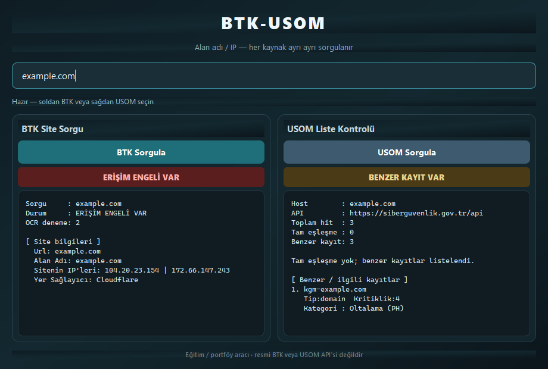
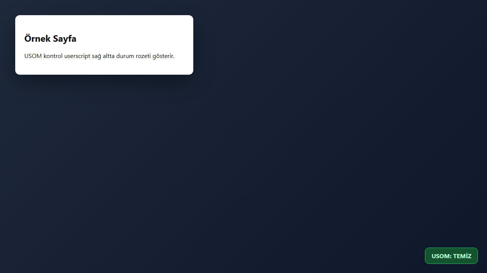

# BTK-USOM Sorgulama

> 🇹🇷 [Türkçe sürüm için tıklayın](README-tr.md)

<p align="center">
  
  
  
  
</p>

<p align="center">
  
  
  
</p>

<p align="center">
  <strong>Dual GUI: BTK site query (OCR) + USOM/SGB malicious list API</strong>
</p>

<p align="center">
  <a href="https://www.tampermonkey.net/">
    
  </a>
  &nbsp;
  <a href="https://raw.githubusercontent.com/nightsamuraisec/btk-usom-sorgulama/main/usom_link_plugin.user.js">
    
  </a>
</p>

<p align="center">
  <a href="#-about-the-project">About</a> ·
  <a href="#-screenshots">Screenshots</a> ·
  <a href="#-tampermonkey-userscript">Userscript</a> ·
  <a href="#-features">Features</a> ·
  <a href="#-folder-structure">Structure</a> ·
  <a href="#-built-with">Built With</a> ·
  <a href="#-getting-started">Getting Started</a> ·
  <a href="#-usage">Usage</a>
</p>

---

## 📌 About The Project

PyQt5 dual-panel app: BTK public site-query (OCR captcha) and USOM/SGB address API. Optional Tampermonkey badge script included. Education/portfolio — not an official API.

---

## 🖼 Screenshots

> Real UI captures under `screenshots/`.

### GUI



*BTK-USOM dual panel*

### USOM Badge



*USOM Badge*

---

## 🧩 Tampermonkey Userscript

1. Install **Tampermonkey**:
   - [Chrome / Edge](https://chromewebstore.google.com/detail/tampermonkey/dhdgffkkebhmkfjojejmpbldmpobfkfo)
   - [Firefox](https://addons.mozilla.org/firefox/addon/tampermonkey/)
2. Click **Install USOM Userscript** (opens the raw `.user.js` — Tampermonkey prompts to add it):

   **→ [Install usom_link_plugin.user.js](https://raw.githubusercontent.com/nightsamuraisec/btk-usom-sorgulama/main/usom_link_plugin.user.js)**

Direct raw URL:

```text
https://raw.githubusercontent.com/nightsamuraisec/btk-usom-sorgulama/main/usom_link_plugin.user.js
```

---

## ✨ Features

- 🔍 Domain query automation
- 🖼 Captcha + Tesseract OCR
- 🛡 USOM status badge userscript

- 📸 **Automatic `screenshots/` media folder** — On launch (or first save), the app creates a `screenshots/` directory in the working folder. Screenshots, captures, and exports are stored there in an organized way. No manual folder setup required.

---

## 🗂 Folder Structure

```text
btk-usom-sorgulama/
├── btk_query.py
├── usom_link_plugin.user.js
├── requirements.txt
├── screenshots/
│   ├── gui.png
│   └── usom-badge.png
├── README.md
└── README-tr.md
```

> `screenshots/` — media output (screenshots, captures, exports). README images are referenced from here.

---

## 🛠 Built With

- Python + Requests / BeautifulSoup
- Tesseract OCR
- Tampermonkey

---

## 🚀 Getting Started

### Prerequisites

Python 3.10+, Tesseract OCR, Tampermonkey (for the userscript).

### Installation

```bash
git clone https://github.com/nightsamuraisec/btk-usom-sorgulama.git
cd btk-usom-sorgulama
python -m venv .venv
# Windows:
.venv\Scripts\activate
pip install -r requirements.txt
python btk_query.py
```

### Environment Variables

Copy `.env.example` to `.env` when needed:

```env
# .env.example
SCREENSHOTS_DIR=screenshots
APP_DEBUG=false
```

---

## 📖 Usage

```bash
python btk_query.py
```

Userscript (one-click after Tampermonkey is installed):  
[Install usom_link_plugin.user.js](https://raw.githubusercontent.com/nightsamuraisec/btk-usom-sorgulama/main/usom_link_plugin.user.js)

### Saving into `screenshots/`

1. Start the app — `screenshots/` is created automatically if missing.
2. Trigger a capture / export / QR save action.
3. Check the files:

```bash
dir screenshots          # Windows
ls screenshots           # Linux / macOS
```

---

## 📄 License

Distributed under the **MIT License**. See [`LICENSE`](LICENSE).

Issues and contributions are welcome via GitHub.

---

<p align="center"><sub>BTK-USOM Sorgulama · by <a href="https://github.com/nightsamuraisec">nightsamuraisec</a> · MIT
